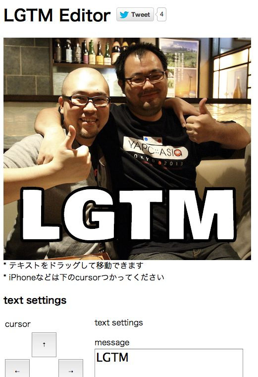

LGTM Editor
==============



LGTMの画像を作成します。

全部Javascriptで動作します。

[sample site](http://s.cfe.jp/lgtm/)

# setup

`by remote file`を利用するには`proxy.php`を利用するセットアップが必要です、Composer installしてください。

```
$ composer install
```

# see also

[LGTM.in/g](http://www.lgtm.in/)

[LGTM Generator](http://blog.hateblo.jp/entry/2014/02/10/193257)

# btw

DataURLをクロスブラウザで良い感じに保存する方法が見つかりません…。
